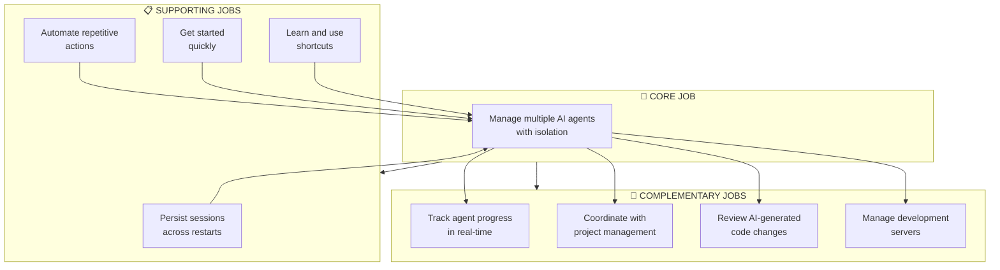
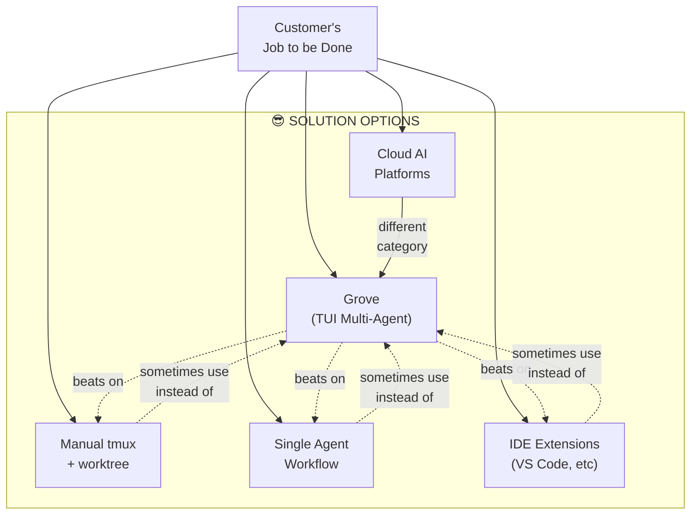
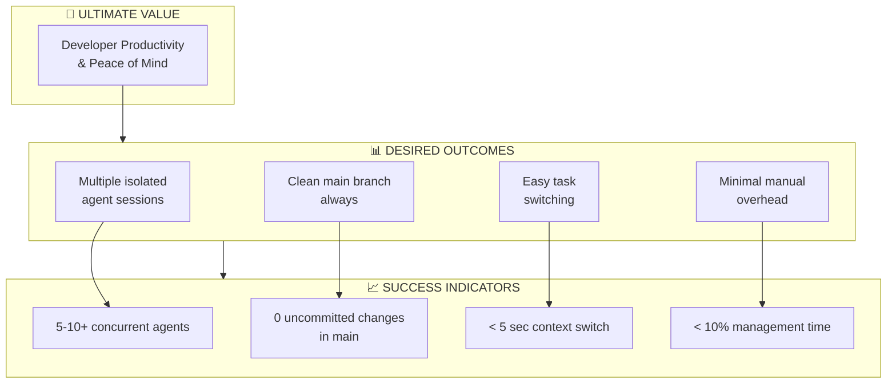
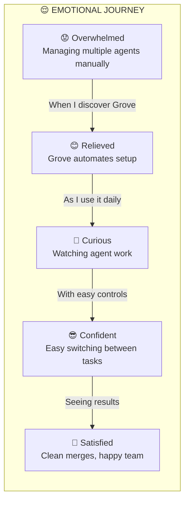

# Jobs to be Done (JTBD): Grove

**Version:** 1.0  
**Date:** March 1, 2026  
**Solution:** Grove - AI Agent Worktree Manager

---

## Executive Summary

This document applies the Jobs to be Done (JTBD) framework to analyze Grove, a Terminal User Interface (TUI) application for managing multiple AI coding agents with git worktree isolation. The JTBD framework helps understand the fundamental jobs customers hire Grove to accomplish, rather than focusing on features or technical implementation.

---

## 1. Core Job Definition

### Primary Job Statement

> **When** I need to work on multiple AI-assisted development tasks simultaneously, **I want** to manage each AI agent in an isolated environment without them interfering with each other, **so I can** maintain clean codebase, track progress easily, and seamlessly switch between tasks.

### Alternative Core Job Statement

> **When** I'm using AI coding assistants to accelerate my development workflow, **I want** a unified interface to create, monitor, and control multiple AI agent sessions while keeping each task's work isolated, **so I can** be productive with multiple concurrent AI-assisted projects without manual coordination overhead.

### Core Job Context

| Element | Description |
|---------|-------------|
| **Situation** | Working on software development projects, needing to leverage AI coding agents |
| **Motivation** | Manage multiple AI agent sessions efficiently with isolation and organization |
| **Desired Outcome** | Clean codebase, easy task switching, progress visibility, minimal manual overhead |

---

## 2. Related Jobs

### 2.1 Complementary Jobs

These are jobs that customers typically do alongside the core job:

| Job | Statement |
|-----|-----------|
| **Track Progress** | When I'm managing AI agents, I want to see their status and output in real-time, so I can understand what's happening without constantly checking |
| **Coordinate with PM** | When I'm using AI agents for tasks, I want to link them to our project management system, so work is visible to the team |
| **Review Changes** | When AI agents make changes, I want to review the diffs, so I can validate what was done before merging |
| **Manage Development Servers** | When AI agents are working, I want to start/stop dev servers for each, so I can test the code being generated |

### 2.2 Competing Jobs

These are alternative approaches customers might use instead of Grove:

| Job | Statement | Why They Might Choose It |
|-----|-----------|-------------------------|
| **Manual tmux + git worktree** | When I need AI agent isolation, I want to manually create tmux sessions and git worktrees | More control, no new tool to learn |
| **Single AI Agent** | When I'm working on a project, I want to use just one AI agent at a time | Simplicity, less overhead |
| **IDE Extensions** | When I'm coding, I want to use AI via VS Code/JetBrains extensions | Integrated experience, familiar UI |
| **Cloud AI Platforms** | When I need AI assistance, I want to use cloud-based AI services | No local setup, more powerful models |

### 2.3 Supporting Jobs

These jobs make the core job easier to accomplish:

| Job | Statement |
|-----|-----------|
| **Session Persistence** | When I restart Grove, I want my agents to automatically resume, so I don't lose context |
| **Automation Hooks** | When events happen (task assigned, code pushed), I want automated actions to trigger, so I don't do repetitive work |
| **Setup Guidance** | When I'm new to Grove, I want guided setup wizards, so I can get started quickly |
| **Learn Shortcuts** | When I'm using Grove, I want to see keyboard shortcuts, so I can work faster |

---

## 3. Desired Outcomes

### 3.1 Core Job Outcomes

| Outcome | Metric | Target |
|---------|--------|--------|
| **Isolate agent work** | Number of agents working simultaneously without interference | 5-10+ agents |
| **Maintain clean main branch** | Number of uncommitted changes in main branch | 0 |
| **Easy task switching** | Time to switch between agent contexts | < 5 seconds |
| **Reduced manual overhead** | Time spent managing vs. actually developing | < 10% of total time |

### 3.2 Complementary Job Outcomes

| Outcome | Metric | Target |
|---------|--------|--------|
| **Real-time visibility** | Time from agent action to UI update | < 1 second |
| **PM integration accuracy** | Task linkage success rate | 100% |
| **Code review efficiency** | Time to review AI-generated diff | < 10 minutes per PR |
| **Dev server reliability** | Server uptime during agent work | 99%+ |

### 3.3 Supporting Job Outcomes

| Outcome | Metric | Target |
|---------|--------|--------|
| **Session recovery** | Agents automatically resumed on restart | 100% |
| **Automation success** | Hook execution success rate | 95%+ |
| **Onboarding time** | Time from install to first agent | < 15 minutes |
| **Shortcut adoption** | % of users using keyboard vs. mouse | > 90% |

---

## 4. Mermaid Diagrams

### 4.1 Job Map: Hierarchy of Jobs

### 4.2 Progress Diagram: Customer Journey

```mermaid
flowchart LR
    subgraph Phase1["📥 ACQUISITION"]
        A1["Discover Grove"]
        A2["Install dependencies\n(tmux, git)"]
        A3["Run grove\nin repository"]
    end
    
    subgraph Phase2["⚙️ SETUP"]
        S1["Complete setup wizard"]
        S2["Configure AI agent\npreference"]
        S3["Set up integrations\n(Git, PM)"]
    end
    
    subgraph Phase3["🚀 CORE USAGE"]
        U1["Create first\nAI agent"]
        U2["Agent creates\nworktree + session"]
        U3["Monitor agent\nactivity"]
        U4["Attach to agent\nwhen needed"]
    end
    
    subgraph Phase4["🔧 ONGOING"]
        O1["Create additional\nagents"]
        O2["Merge/push\nbranches"]
        O3["Link to PM tasks"]
        O4["Manage dev servers"]
    end
    
    A1 --> A2 --> A3 --> S1 --> S2 --> S3 --> U1 --> U2 --> U3 --> U4 --> O1 --> O2 --> O3 --> O4
```

### 4.3 Competing Jobs Diagram

### 4.4 Outcome Hierarchy

### 4.5 Emotional Journey Map

---

## 5. Job Story Variations

### 5.1 Solo Developer

> **When** I'm the only developer using AI assistants on my project, **I want** to create isolated worktrees for each AI agent so they don't interfere with each other, **so I can** work on multiple features simultaneously without breaking my main branch.

### 5.2 Team Lead

> **When** our team is using AI agents for development, **I want** visibility into what each agent is doing and integration with our PM system, **so I can** coordinate work and report progress to stakeholders.

### 5.3 DevOps Engineer

> **When** I need to automate development workflows with AI, **I want** hooks that trigger actions when events happen, **so I can** reduce manual repetitive tasks.

---

## 6. Unmet Needs & Opportunities

### 6.1 Unmet Needs

Based on the JTBD analysis, these needs are not fully addressed:

| Need | Description | Opportunity |
|------|-------------|-------------|
| **Headless Mode** | Run Grove without TUI for automation | Add CLI mode for scripting |
| **Multi-user** | Share agent sessions with team members | Consider collaboration features |
| **Cloud Sync** | Access agents from different machines | Cloud session management |

### 6.2 Future Opportunities

| Opportunity | Related Job | Value |
|-------------|-------------|-------|
| **Autonomous Agents** | Core Job | Agents that work without constant monitoring |
| **Smart Automation** | Supporting Job | AI-powered automation suggestions |
| **Cross-repo** | Core Job | Manage agents across multiple repositories |

---

## 7. Competitive Landscape

| Solution | Core Job Addressed | How Grove Wins |
|----------|-------------------|----------------|
| **Manual tmux + git** | Same | Unified UI, automation, integration |
| **IDE Extensions** | Different (single agent) | Multi-agent, worktree isolation, TUI |
| **Cloud AI Platforms** | Different (outsourced) | Local control, privacy, customization |
| **git-worktree-manager** | Partial (worktrees only) | Full agent management, UI, integrations |

---

## 8. Summary

### The Core Job

**When** developers need to leverage AI coding assistants for multiple concurrent tasks, **they want** a unified interface to create, monitor, and manage isolated AI agent sessions, **so they can** maintain productivity without the overhead of manual coordination and without risking interference between tasks.

### Key Differentiators

1. **Isolation**: Git worktree-based isolation prevents agent interference
2. **Multi-Agent**: Support for 5-10+ concurrent AI agent sessions
3. **Integration**: Native PM and Git provider integrations
4. **Persistence**: Session survival across restarts
5. **Automation**: Event-driven hooks for workflow automation

### Success Metrics

- Customers can run 5-10+ isolated AI agents simultaneously
- Main branch remains clean (0 uncommitted changes)
- Context switching takes less than 5 seconds
- Less than 10% of development time spent on management

---

**Document Version:** 1.0  
**Last Updated:** March 1, 2026  
**Solution Version:** Grove 0.2.0
