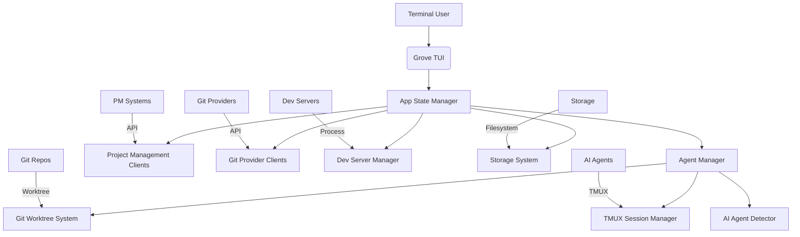

# Product Requirement Document (PRD)

## 1. Document Overview
This PRD documents Grove, a terminal UI for managing multiple AI coding agents with git worktree isolation. It bridges the gap between code implementation and business requirements by detailing the system's purpose, functionality, and technical design.

---

## 2. Objective
Enable developers to manage multiple AI coding agents simultaneously, each working in isolated git worktrees, with real-time monitoring, project management integrations, and seamless workflow orchestration.

---

## 3. Scope
**In Scope:**
- Multi-agent management with isolated worktrees
- Real-time agent monitoring and status tracking
- Git worktree creation and management
- TMUX session management for agent interaction
- AI agent detection and command building
- Project management integrations (Asana, Notion, ClickUp, Airtable, Linear)
- Git provider integrations (GitHub, GitLab, Codeberg)
- Dev server management per agent
- Session persistence across restarts
- Customizable keybinds and UI themes
- System metrics monitoring

**Out of Scope:**
- AI model training or development
- Cloud infrastructure provisioning
- IDE plugin development
- Mobile application development
- Natural language processing improvements

---

## 4. User Personas

### 4.1 Primary User
**Persona:** Software Engineering Team Lead
- **Name:** Alex Rivera
- **Role:** Engineering Manager at Tech Startup
- **Goals:**
  - Manage multiple AI agents working on different features simultaneously
  - Track progress across various project management systems
  - Ensure code quality through isolated experimentation
  - Streamline developer onboarding and workflow
- **Use Cases:**
  - Spins up agents for feature branches, bug fixes, and experiments
  - Attaches to specific agents to review or guide their work
  - Integrates with Asana to automatically update task status
  - Monitors agent resource usage to optimize costs
  - Sets up standardized development environments for team members

### 4.2 Secondary User
**Persona:** Individual Developer / Contractor
- **Name:** Samira Patel
- **Role:** Freelance Full-Stack Developer
- **Goals:**
  - Work on multiple client projects concurrently without context switching
  - Maintain clean separation between different projects
  - Leverage AI assistance for routine coding tasks
  - Provide clients with transparent progress tracking
- **Use Cases:**
  - Creates isolated worktrees for each client project
  - Uses different AI agents specialized for frontend/backend work
  - Tracks time spent on different tasks via PM integrations
  - Quickly switches between projects with preserved context
  - Demonstrates work-in-progress to clients through controlled access

### 4.3 Tertiary User
**Persona:** Open Source Maintainer
- **Name:** Jordan Kim
- **Role:** Maintainer of Popular JavaScript Library
- **Goals:**
  - Manage community contributions efficiently
  - Automate routine maintenance tasks
  - Maintain high code quality standards
  - Reduce burnout from repetitive tasks
- **Use Cases:**
  - Spins agents to handle triage of incoming issues
  - Uses agents to generate PRs for dependency updates
  - Integrates with Linear to track maintenance workflow
  - Monitors agent activity for anomalous behavior
  - Creates standardized processes for new contributor onboarding

---

## 5. Functional Requirements

| ID | Feature | Description | Source |
|----|---------|-------------|--------|
| FR-001 | Multi-Agent Management | Create, monitor, and manage multiple AI coding agents simultaneously | src/app/mod.rs, src/agent/model.rs |
| FR-002 | Git Worktree Isolation | Each agent operates in its own isolated git worktree to prevent interference | src/git/worktree.rs, src/git/mod.rs |
| FR-003 | TMUX Session Integration | Attach to agent terminals via TMUX for direct interaction | src/tmux/mod.rs, src/tmux/session.rs |
| FR-004 | AI Agent Detection | Automatically detect and resume sessions with Claude Code, Opencode, Codex, and Gemini CLI | src/claude_code/mod.rs, src/opencode/mod.rs, src/codex/mod.rs, src/gemini/mod.rs |
| FR-005 | Real-Time Monitoring | Live output streaming, status detection (running/waiting/error), and token usage tracking | src/app/state.rs, src/agent/detector.rs |
| FR-006 | Project Management Integrations | Sync with Asana, Notion, ClickUp, Airtable, and Linear for task tracking | src/core/projects/ |
| FR-007 | Git Provider Integrations | Connect with GitHub, GitLab, and Codeberg for MR/PR status and pipeline information | src/core/git_providers/ |
| FR-008 | Dev Server Management | Start, restart, and monitor development servers per agent with port management | src/devserver/mod.rs, src/devserver/process.rs |
| FR-009 | Session Persistence | Agent configurations and worktrees persist across application restarts | src/storage/mod.rs, src/storage/session.rs |
| FR-010 | Customizable Keybinds | Fully configurable keyboard shortcuts for all operations | src/app/config.rs, src/ui/components/settings_modal.rs |
| FR-011 | System Metrics Monitoring | Real-time CPU and memory usage tracking for all agents | src/ui/components/system_metrics.rs |
| FR-012 | Worktree Symlink Management | Automatically create and manage symbolic links for development workflows | src/git/worktree.rs |
| FR-013 | Agent Status Detection | Intelligent status detection based on output patterns and process states | src/agent/detector.rs |
| FR-014 | Task Reassignment Workflow | Safely move PM tasks between agents with confirmation prompts | src/app/task_list.rs |
| FR-015 | Preview System | Multiple preview modes including agent output, git diffs, and file browsing | src/ui/components/output_view.rs, src/ui/components/diff_view.rs, src/ui/components/file_browser.rs |

**Requirements Analysis:**
- All core functionality is implemented in Rust with async/await patterns
- State management uses a centralized AppState pattern with granular updates
- Communication between components uses Tokio channels (mpsc, watch)
- Terminal interface built with ratatui and crossterm
- Configuration follows TOML format with global and project-level scoping
- Error handling uses anyhow::Result for proper propagation
- Logging implements structured tracing with configurable levels

---

## 6. Technical Architecture

### 6.1 Technology Stack
- **Language:** Rust 1.70+
- **Async Runtime:** Tokio with multi-threaded scheduler
- **TUI Framework:** ratatui 0.25+
- **Terminal Handling:** crossterm 0.27+
- **Git Operations:** git2 0.16+ (libgit2 bindings)
- **TMUX Control:** Direct tmux command execution
- **Configuration:** serde 1.0+ with TOML support
- **Dependency Tracking:** cargo with semantic versioning
- **Logging:** tracing with tracing-subscriber
- **Error Handling:** anyhow for contextual errors
- **UUID Generation:** uuid crate for agent identification

### 6.2 Architecture Diagram (Mermaid)


### 6.3 Data Flow
1. User initiates agent creation through TUI interface
2. Grove validates git repository and creates isolated worktree
3. TMUX session is created for the agent with appropriate AI command
4. Agent begins processing in isolated environment
5. Background tasks continuously monitor:
   - Agent output for status changes
   - Git provider APIs for MR/PR updates
   - Project management systems for task status
   - Dev server processes for health
   - System resources for metrics
6. State updates propagate through watch channels to UI components
7. User can attach to agent TMUX session for direct interaction
8. On exit or suspend, session state is persisted to disk
9. Configuration changes are saved to global and project config files

### 6.4 Key Components
- **AppState** (`src/app/mod.rs`): Central state management
- **AgentManager** (`src/agent/manager.rs`): Agent lifecycle operations
- **Worktree System** (`src/git/worktree.rs`): Git worktree creation/management
- **TMUX Manager** (`src/tmux/mod.rs`): Terminal session handling
- **AI Detectors** (`src/*_code/mod.rs`): Agent-specific command building
- **Storage System** (`src/storage/mod.rs`): Session persistence
- **Project Management Clients** (`src/core/projects/*`): API integrations
- **Git Provider Clients** (`src/core/git_providers/*`): VCS integrations
- **DevServer Manager** (`src/devserver/mod.rs`): Process management
- **UI Components** (`src/ui/*`): Terminal interface elements

---

## 7. Non-Functional Requirements

| Category | Requirement | Implementation Status |
|----------|-------------|------------------------|
| **Performance** | Handle 10+ concurrent agents with <100ms UI response | Implemented with async polling |
| **Scalability** | Support 50+ agents in session history | Limited by system resources |
| **Security** | Isolated worktrees prevent cross-agent contamination | Implemented via git worktree |
| **Reliability** | Session persistence across restarts | Implemented with TOML storage |
| **Maintainability** | Modular architecture with clear separation of concerns | Well-structured module system |
| **Usability** | Intuitive keybinds with comprehensive help system | Complete with documentation |
| **Observability** | Detailed logging and metrics collection | Comprehensive tracing implemented |
| **Portability** | Cross-platform support (Linux/macOS) | tmux dependency limits Windows |
| **Resource Efficiency** | Low CPU/memory overhead when idle | Efficient polling mechanisms |
| **Backward Compatibility** | Configuration migration handled gracefully | Versioned config system |

---

## 8. Assumptions & Risks

### 8.1 Assumptions
- Users have basic familiarity with tmux concepts
- Git version 2.5+ with worktree support is available
- At least one supported AI coding agent is installed
- Project operates within a git repository
- Users understand the concept of isolated worktrees
- Terminal supports 256-color mode for UI rendering
- Network connectivity for API integrations when configured
- Sufficient disk space for multiple worktrees (~1-2GB per agent)
- Users have appropriate permissions for git operations

### 8.2 Risks
- tmux compatibility issues on certain terminal emulators
- Disk space exhaustion with many concurrent worktrees
- Git worktree corruption from improper cleanup
- AI agent session detection failures due to output changes
- API rate limiting from project management/git providers
- Security vulnerabilities in dependencies (mitigated by cargo audit)
- Configuration drift between global and project settings
- Performance degradation with excessive output buffering
- Encoding issues in agent output parsing

---

## 9. Dependencies

### Direct Dependencies
| Dependency | Version | Purpose |
|-----------|---------|---------|
| ratatui | 0.25+ | Terminal user interface framework |
| crossterm | 0.27+ | Terminal handling and input |
| tokio | 1.32+ | Async runtime |
| git2 | 0.16+ | Git operations (libgit2 bindings) |
| serde | 1.0+ | Serialization framework |
| serde_json | 1.0+ | JSON handling |
| toml | 0.8+ | Configuration file format |
| uuid | 1.3+ | Unique identifier generation |
| tracing | 0.1+ | Structured logging |
| tracing-subscriber | 0.3+ | Logging implementation |
| anyhow | 1.0+ | Error handling |
| sysinfo | 0.30+ | System metrics collection |

### Platform Dependencies
- tmux (terminal multiplexer)
- git (version 2.5+ with worktree support)
- At least one AI coding agent: claude, opencode, codex, or gemini

### Optional Integrations
| Service | Purpose | Required Token |
|---------|---------|----------------|
| GitHub | PR/status tracking | GITHUB_TOKEN |
| GitLab | MR/pipeline tracking | GITLAB_TOKEN |
| Codeberg | PR/pipeline tracking | CODEBERG_TOKEN |
| Asana | Task synchronization | ASANA_TOKEN |
| Notion | Task/database sync | NOTION_TOKEN |
| ClickUp | Task management | CLICKUP_TOKEN |
| Airtable | Database integration | AIRTABLE_TOKEN |
| Linear | Issue tracking | LINEAR_TOKEN |

---

## 10. Risks and Assumptions Log

**Technical Debts Identified:**
- Some error handling could be more specific (uses anyhow broadly)
- Certain polling intervals are hardcoded rather than configurable
- Legacy agent migration logic could be simplified
- Some UI components have tight coupling to state structure
- Configuration validation could be more comprehensive

**Business Assumptions:**
- Target users are comfortable with terminal-based workflows
- Privacy-conscious developers will pay for enhanced security features
- Team leads value centralized agent management over individual tooling
- Integration with existing PM systems is a significant selling point
- The learning curve is offset by productivity gains

**Mitigation Strategies:**
- Comprehensive logging for debugging complex issues
- Graceful degradation when integrations fail
- Clear error messages with troubleshooting guidance
- Configurable timeouts and retry mechanisms
- Regular dependency audits using cargo audit
- Modular design allowing incremental improvements

---

## 11. Future Roadmap
1. **Phase 1 (Current):** Stabilize core multi-agent worktree management
2. **Phase 2:** Enhance AI agent detection and session resilience
3. **Phase 3:** Expand project management integration depth and bi-directional sync
4. **Phase 4:** Add collaborative features for team workflows
5. **Phase 5:** Implement usage analytics and optimization recommendations
6. **Phase 6:** Develop mobile companion app for remote monitoring
7. **Phase 7:** Add AI-powered code review and suggestion features
8. **Phase 8:** Create marketplace for custom agent templates and workflows

---

## Appendix

### Codebase Structure
```
src/
├── agent/              # Agent modeling and status detection
│   ├── model.rs        # Agent struct and state definitions
│   ├── mod.rs          # Module exports
│   ├── detector.rs     # Status detection from output/processes
│   └── manager.rs      # Agent lifecycle operations
├── app/                # Core application state and logic
│   ├── mod.rs          # Module exports
│   ├── state.rs        # Central AppState definition
│   ├── config.rs       # Configuration loading and management
│   ├── action.rs       # User action definitions
│   └── task_list.rs    # Task management operations
├── core/               # Core integrations and shared functionality
│   ├── mod.rs          # Module exports
│   ├── projects/       # Project management system integrations
│   │   ├── mod.rs
│   │   ├── asana/      # Asana API client
│   │   ├── notion/     # Notion API client
│   │   ├── clickup/    # ClickUp API client
│   │   ├── airtable/   # Airtable API client
│   │   ├── linear/     # Linear API client
│   │   └── helpers.rs  # Shared PM integration logic
│   └── git_providers/  # Git platform integrations
│       ├── mod.rs
│       ├── github/     # GitHub API client
│       ├── gitlab/     # GitLab API client
│       ├── codeberg/   # Codeberg API client
│       ├── helpers.rs  # Shared git provider logic
│       └── common.rs   # Common types and traits
├── devserver/          # Development server management
│   ├── mod.rs          # Module exports
│   ├── manager.rs      # DevServerManager definition
│   └── process.rs      # Individual dev server process handling
├── git/                # Git operations and worktree management
│   ├── mod.rs          # Module exports
│   ├── worktree.rs     # Git worktree creation/management
│   ├── status.rs       # Git status operations
│   ├── remote.rs       # Remote repository operations
│   └── sync.rs         # Repository synchronization
├── pi/                 # Pi-session (AI agent) integration
│   ├── mod.rs          # Module exports
│   └── conversion.rs   # Action/RPC message conversion
├── storage/            # Session persistence
│   ├── mod.rs          # Module exports
│   └── session.rs      # Session saving/loading logic
├── tmux/               # TMUX session management
│   ├── mod.rs          # Module exports
│   └── session.rs      # Individual TMUX session handling
├── ui/                 # Terminal user interface
│   ├── mod.rs          # Module exports
│   ├── app.rs          # Main UI rendering and event loop
│   ├── appearance.rs   # Theme and styling definitions
│   ├── helpers.rs      # UI utility functions
│   └── components/     # Reusable UI components
│       ├── agent_list.rs       # Agent listing and selection
│       ├── output_view.rs      # Agent output display
│       ├── diff_view.rs        # Git diff visualization
│       ├── file_browser.rs     # Worktree file navigation
│       ├── settings_modal.rs   # Configuration interface
│       ├── system_metrics.rs   # Resource usage monitoring
│       ├── task_list_modal.rs  # PM task management
│       ├── devserver_view.rs   # Development server status
│       ├── column_selector.rs  # Preview tab management
│       ├── status_debug_overlay.rs # Detailed agent diagnostics
│       ├── pm_status_debug_overlay.rb # PM integration debugging
│       ├── setup_dialog.rs     # Initial configuration wizard
│       ├── git_setup_modal.rs  # Git provider configuration
│       ├── pm_setup_modal.rs   # Project management configuration
│       ├── global_setup.rs     # First-run configuration
│       ├── tutorial.rs         # Interactive tutorial system
│       ├── loading_overlay.rs  # Async operation indicators
│       ├── toast.rs            # Temporary notification system
│       └── modal.rs            # Base modal window implementation
├── opencode/           # Opencode-specific integration
│   ├── mod.rs          # Module exports
│   └── session.rs      # Session detection and command building
├── claude_code/        # Claude Code-specific integration
│   ├── mod.rs          # Module exports
│   └── session.rs      # Session detection and command building
├── codex/              # Codex-specific integration
│   ├── mod.rs          # Module exports
│   └── session.rs      # Session detection and command building
├── gemini/             # Gemini CLI-specific integration
│   ├── mod.rs          # Module exports
│   └── session.rs      # Session detection and command building
├── automation/         # Task automation systems
│   ├── mod.rs          # Module exports
│   └── executor.rs     # Automation execution logic
├── cache/              # Caching mechanisms for API integrations
│   └── mod.rs          # Module exports
├── ci/                 # Continuous integration monitoring
│   ├── mod.rs          # Module exports
│   └── types.rs        # CI status type definitions
├── version.rs          # Version information and build metadata
└── lib.rs              # Crate root module exports
```

### Key Implementation Files
- `src/main.rs`: Application entry point and event loop
- `src/lib.rs`: Module declarations and exports
- `src/app/state.rs`: Central application state management
- `src/agent/model.rs`: Core agent data structure
- `src/git/worktree.rs`: Git worktree creation and management
- `src/tmux/session.rs`: TMUX session lifecycle handling
- `src/storage/session.rs`: Session persistence logic
- `src/core/projects/mod.rs`: Project management integration framework
- `src/core/git_providers/mod.rs`: Git provider integration framework
- `src/ui/app.rs`: Main terminal user interface implementation
- `src/pi/mod.rs`: Pi-session (AI agent) RPC integration layer