# Grove Technical Architecture Documentation

**Version:** 2.0  
**Date:** March 1, 2026  
**Repository:** github.com/ziim/grove

---

## Table of Contents

1. [Architecture Overview](#1-architecture-overview)
2. [System Architecture Diagrams](#2-system-architecture-diagrams)
3. [Technology Stack](#3-technology-stack)
4. [Key Components](#4-key-components)
5. [Use Cases](#5-use-cases)
6. [Data Flow Architecture](#6-data-flow-architecture)
7. [Configuration System](#7-configuration-system)
8. [Key Design Decisions](#8-key-design-decisions)
9. [Module Documentation](#9-module-documentation)
10. [File Structure](#10-file-structure)
11. [Appendix](#11-appendix)

---

## 1. Architecture Overview

### 1.1 High-Level Description

Grove is a Terminal User Interface (TUI) application for managing multiple AI coding agents with git worktree isolation. It provides a unified interface to:

- Create and manage isolated development environments using git worktrees
- Monitor AI agent status in real-time
- Integrate with project management tools (Asana, Notion, ClickUp, Airtable, Linear)
- Integrate with git hosting platforms (GitLab, GitHub, Codeberg)
- Manage development servers per agent
- Automate workflows through custom scripts

### 1.2 Architectural Patterns

Grove employs several architectural patterns:

1. **Action-Based State Management**: All state mutations flow through an `Action` enum, enabling predictable state transitions and easier debugging
2. **Widget Pattern**: UI components follow a builder pattern for composable rendering
3. **Async Runtime**: Uses tokio for concurrent operations (API polling, git operations)
4. **Module Isolation**: Clear separation between concerns with public re-exports

### 1.3 Component Overview

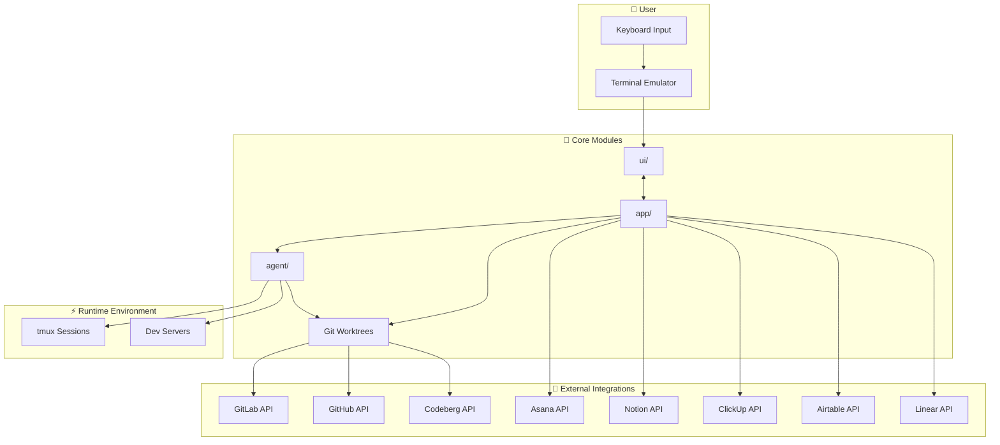

---

## 2. System Architecture Diagrams

### 2.1 High-Level Component Diagram

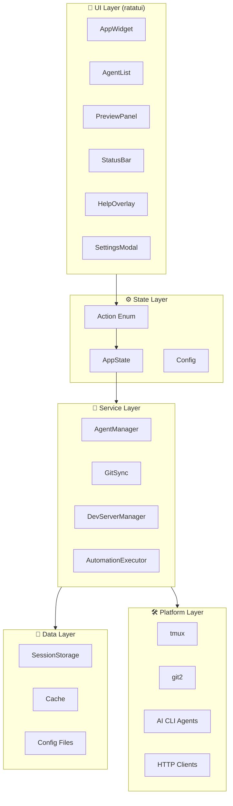

### 2.2 Main Event Loop Architecture

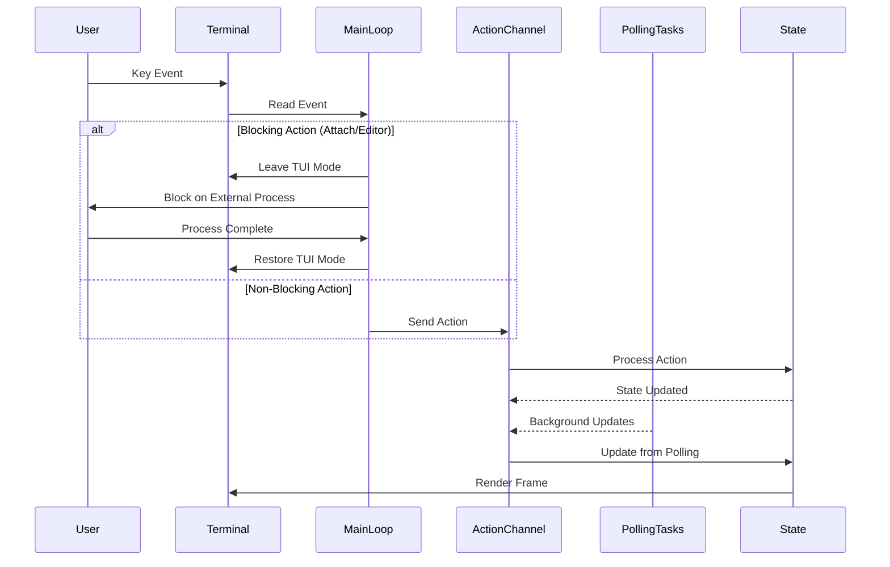

### 2.3 Agent Creation Flow

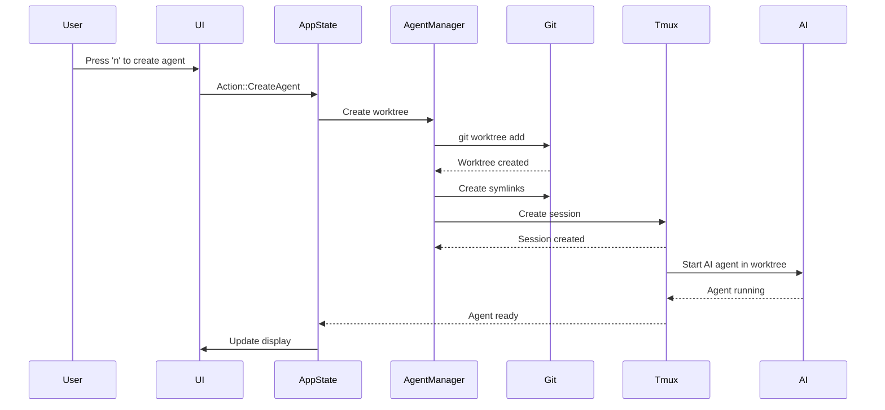

### 2.4 Git Integration Architecture

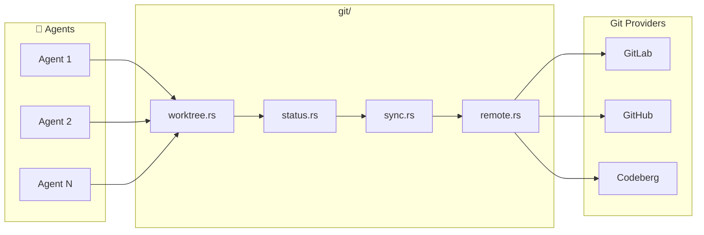

### 2.5 State Management Flow

```mermaid
stateDiagram-v2
    [*] --> --> Running: Init Complete
    Running Loading
    Loading --> InputMode: User Input
    InputMode --> Running: Submit/Cancel
    Running --> Settings: Open Settings
    Settings --> Running: Close Settings
    Running --> Help: Press ?
    Help --> Running: Close Help
    Running --> [*]: Quit
```

### 2.6 Data Flow Architecture

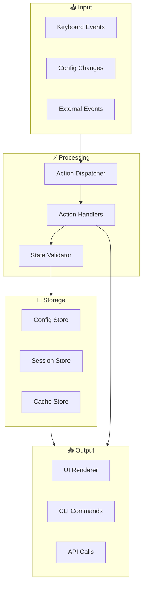

### 2.7 Polling Architecture

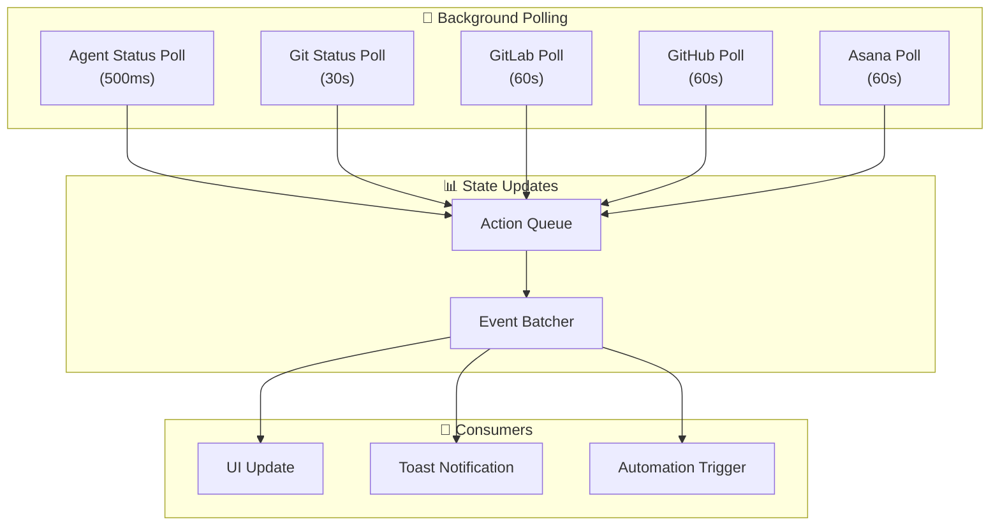

---

## 3. Technology Stack

| Category | Technology | Purpose |
|----------|------------|---------|
| **Language** | Rust 2021 | Core application language |
| **UI Framework** | ratatui 0.29 | Terminal UI rendering |
| **Terminal** | crossterm 0.28 | Terminal events & input |
| **Async Runtime** | tokio | Concurrent operations |
| **Git Operations** | git2 | Git worktree management |
| **HTTP Client** | reqwest | API integrations |
| **Serialization** | serde, toml | Config & state persistence |
| **Database** | rusqlite | Cache storage |
| **Error Handling** | anyhow | Error propagation |
| **Logging** | tracing | Debug logging |
| **System Info** | sysinfo | CPU/memory metrics |

---

## 4. Key Components

### 4.1 Application Core (`src/app/`)

The application core manages global state, configuration, and user interactions.

#### `app/mod.rs`
- Re-exports all public types from submodules
- Provides unified public API for the app module

#### `app/action.rs`
- Defines the `Action` enum with 100+ action variants
- All state mutations flow through this enum
- Categories include: navigation, agent management, git operations, PM integration, settings, UI

#### `app/config.rs`
- Configuration structures for global and repo-specific settings
- Supports multiple AI agents: ClaudeCode, Opencode, Codex, Gemini
- Git providers: GitLab, GitHub, Codeberg
- Project management: Asana, Notion, ClickUp, Airtable, Linear
- Keybind customization with conflict detection

#### `app/state.rs`
- `AppState` struct: Central application state
- UI state: modals, dropdowns, input modes
- Agent state: agents map, selection, ordering
- Background task coordination

### 4.2 Agent Management (`src/agent/`)

Manages AI agent lifecycle and status detection.

#### `agent/model.rs`
- `Agent` struct: Core agent representation
- `AgentStatus` enum: Running, AwaitingInput, Completed, Idle, Error, Stopped
- `ProjectMgmtTaskStatus`: Polymorphic status for PM integrations
- Activity tracking with sparkline data

#### `agent/detector.rs`
- Real-time status detection from terminal output
- Pattern matching for agent states (Reading, Thinking, etc.)
- Checklist progress detection
- MR/PR URL extraction

#### `agent/manager.rs`
- Agent lifecycle management
- Worktree creation and cleanup
- tmux session management

### 4.3 Git Operations (`src/git/`)

Provides git worktree and sync functionality.

#### `git/worktree.rs`
- Git worktree creation and deletion
- Symlink management for node_modules, .env, etc.
- Branch management

#### `git/status.rs`
- `GitSyncStatus`: Tracks ahead/behind status
- Diff generation

#### `git/sync.rs`
- Fetch, merge, push operations
- Remote branch management

#### `git/remote.rs`
- Remote URL parsing and validation

### 4.4 UI Components (`src/ui/`)

Terminal UI rendering using ratatui.

#### `ui/app.rs`
- `AppWidget`: Main application widget
- Layout management with split views
- Component composition

#### `ui/components/` (25+ components)
- `agent_list.rs`: Agent list rendering
- `status_bar.rs`: Bottom status bar
- `help_overlay.rs`: Keyboard shortcuts overlay
- `settings_modal.rs`: Settings editor
- `task_list_modal.rs`: PM task browser
- `diff_view.rs`: Git diff viewer
- `output_view.rs`: Agent output display
- `devserver_view.rs`: Dev server logs

### 4.5 Tmux Integration (`src/tmux/`)

Manages tmux sessions for agent isolation.

#### `tmux/session.rs`
- `TmuxSession`: Session lifecycle
- Create, attach, list sessions
- Pane management

### 4.6 Dev Server Management (`src/devserver/`)

Per-agent development server management.

#### `devserver/manager.rs`
- `DevServerManager`: Coordinates all dev servers

#### `devserver/process.rs`
- `DevServer`: Process lifecycle
- Log capture and streaming

### 4.7 Core Integrations (`src/core/`)

External service integrations.

#### `core/git_providers/`
- `gitlab/`: Merge request status, project lookup
- `github/`: Pull request status
- `codeberg/`: PR status, Woodpecker CI, Forgejo Actions

#### `core/projects/`
- `asana/`: Task assignment, status updates
- `notion/`: Database integration
- `clickup/`: List-based tasks
- `airtable/`: Base/table integration
- `linear/`: Team-based issues

---

## 5. Use Cases

### 5.1 Create New Agent

**Description**: User creates a new AI agent with isolated worktree

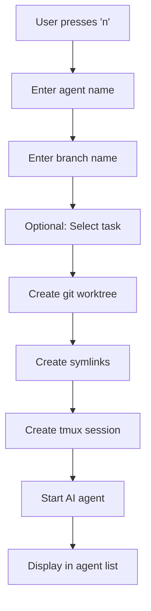

**Outcome**: New agent available in list with isolated worktree

### 5.2 Attach to Agent

**Description**: User attaches to agent's tmux session

**Flow**:
1. User selects agent and presses `Enter`
2. System saves current session
3. System exits TUI mode
4. tmux attaches to agent session
5. User interacts with AI agent
6. User detaches (Ctrl-b d)
7. TUI mode restores

**Outcome**: User can interact directly with AI agent

### 5.3 Merge Main Branch

**Description**: Agent merges main branch into their feature branch

**Flow**:
1. User selects agent and presses `m`
2. Confirmation prompt appears
3. User confirms
4. System sends merge command to tmux
5. AI agent performs merge
6. Status updates in UI

**Outcome**: Agent's branch includes latest from main

### 5.4 Create Merge Request

**Description**: System detects branch and shows MR status

**Flow**:
1. Agent pushes branch
2. Background polling detects new branch
3. API call to GitLab/GitHub/Codeberg
4. MR/PR created or linked
5. Status displayed in agent list

**Outcome**: MR/PR link visible in agent details

### 5.5 Assign Project Task

**Description**: Link agent to project management task

**Flow**:
1. User selects agent and presses `a`
2. Task browser opens
3. User selects task
4. System assigns task to agent
5. Optional: automation script runs

**Outcome**: Agent linked to PM task with status tracking

### 5.6 Start Dev Server

**Description**: Per-agent development server management

**Flow**:
1. User selects agent and presses `Ctrl+s`
2. Warning modal (if enabled)
3. System starts configured dev command
4. Logs stream to devserver view
5. User can attach to server session

**Outcome**: Dev server running for agent's worktree

---

## 6. Data Flow Architecture

### 6.1 Startup Flow

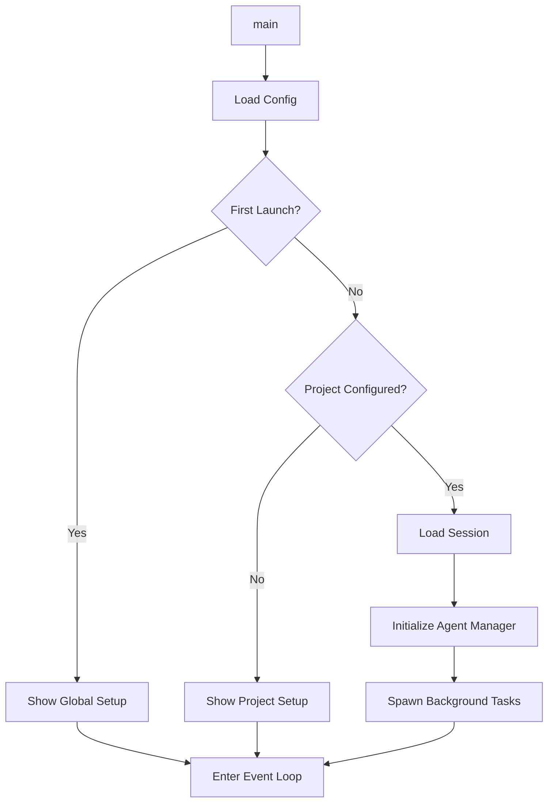

### 6.2 Action Processing Flow

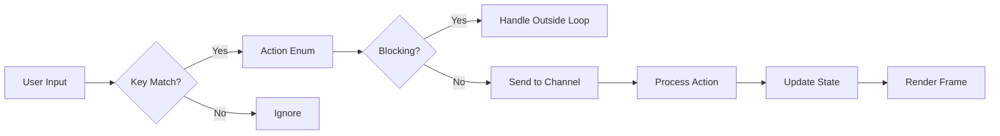

### 6.3 Background Polling Flow

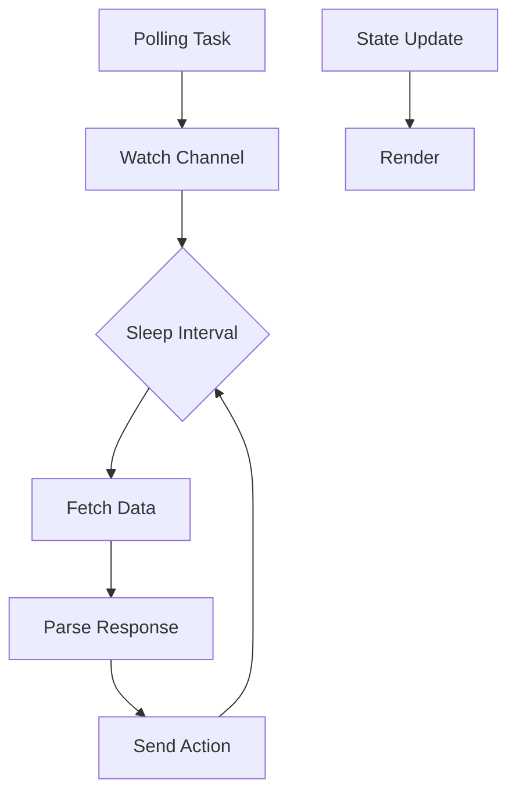

---

## 7. Configuration System

### 7.1 Global Config (`~/.grove/config.toml`)

```toml
[global]
ai_agent = "claude-code"       # claude-code, opencode, codex, gemini
log_level = "info"             # debug, info, warn, error
worktree_location = "project"  # project, home
editor = "code {path}"         # Editor command template
debug_mode = false

[ui]
frame_rate = 30
tick_rate_ms = 250
output_buffer_lines = 5000
show_preview = true
show_metrics = true

[performance]
agent_poll_ms = 500
gitlab_refresh_secs = 60

[keybinds]
nav_down = "Down"
nav_up = "Up"
new_agent = "n"
```

### 7.2 Repo Config (`.grove/project.toml`)

```toml
[git]
provider = "gitlab"           # gitlab, github, codeberg
branch_prefix = "feature/"
main_branch = "main"

[git.gitlab]
project_id = 12345
base_url = "https://gitlab.com"

[project_mgmt]
provider = "asana"

[project_mgmt.asana]
project_gid = "1234567890"
in_progress_section_gid = "1234567891"

[dev_server]
command = "npm run dev"
port = 3000
worktree_symlinks = ["node_modules", ".env"]
```

### 7.3 Environment Variables (Secrets)

```bash
# Git Providers
GITLAB_TOKEN=glpat-xxxx
GITHUB_TOKEN=ghp_xxxx

# Project Management
ASANA_TOKEN=0/xxxx
NOTION_TOKEN=secret_xxxx
CLICKUP_TOKEN=xxxx
LINEAR_TOKEN=xxxx
```

---

## 8. Key Design Decisions

### 8.1 Action-Based State Management

**Decision**: All state mutations flow through an `Action` enum rather than direct method calls.

**Rationale**:
- Predictable state transitions
- Easier debugging with action logging
- Enables undo/redo functionality
- Simplifies testing with action injection

**Trade-offs**:
- More boilerplate defining actions
- Slight indirection overhead

### 8.2 Worktree Isolation

**Decision**: Each agent gets an isolated git worktree rather than branching in the main repository.

**Rationale**:
- Clean separation between agent work
- No pollution of main repo
- Easy cleanup when agent is done
- Parallel development without conflicts

**Trade-offs**:
- Disk space per worktree
- Initial setup time
- Symlink maintenance

### 8.3 Tmux for Agent Sessions

**Decision**: Use tmux for agent session management rather than raw PTY.

**Rationale**:
- Built-in session persistence
- Easy attach/detach
- Works across SSH connections
- Multiple panes per agent

**Trade-offs**:
- Requires tmux installation
- Platform-specific (Unix-like)
- Session naming conventions

### 8.4 Polymorphic PM Status

**Decision**: Use enum for project management status supporting multiple providers.

**Rationale**:
- Single field for all PM systems
- Type-safe provider switching
- Consistent API across providers

**Trade-offs**:
- More complex type definitions
- Pattern matching for each provider

### 8.5 Background Polling

**Decision**: Use async polling for external services rather than webhooks.

**Rationale**:
- Simpler implementation
- No server component needed
- Works with any provider

**Trade-offs**:
- Slight delay in updates
- More network traffic
- Rate limiting concerns

---

## 9. Module Documentation

### 9.1 `src/main.rs`

**Purpose**: Application entry point and main event loop

**Key Responsibilities**:
- Terminal setup (raw mode, alternate screen)
- Configuration loading
- State initialization
- Background task spawning
- Main event loop with action processing

### 9.2 `src/lib.rs`

**Purpose**: Library root, public module re-exports

### 9.3 `src/app/action.rs`

**Purpose**: Action enum defining all possible user interactions

### 9.4 `src/app/config.rs`

**Purpose**: Configuration management and serialization

### 9.5 `src/agent/model.rs`

**Purpose**: Agent data model and status types

### 9.6 `src/git/worktree.rs`

**Purpose**: Git worktree management

### 9.7 `src/tmux/session.rs`

**Purpose**: Tmux session management for agent isolation

### 9.8 `src/devserver/process.rs`

**Purpose**: Per-agent development server management

### 9.9 `src/ui/app.rs`

**Purpose**: Main application widget and layout

---

## 10. File Structure

```
src/
├── main.rs                    # Entry point, event loop
├── lib.rs                     # Module exports
├── version.rs                 # Version info
├── agent/                     # Agent model & management
│   ├── mod.rs
│   ├── model.rs              # Agent, AgentStatus
│   ├── detector.rs           # Status detection
│   └── manager.rs            # Agent lifecycle
├── app/                       # State & configuration
│   ├── mod.rs
│   ├── action.rs             # Action enum
│   ├── config.rs             # Config structures
│   ├── state.rs              # AppState
│   └── task_list.rs          # Task list types
├── git/                       # Git operations
│   ├── mod.rs
│   ├── worktree.rs           # Worktree mgmt
│   ├── status.rs             # Git status
│   ├── sync.rs               # Sync operations
│   └── remote.rs             # Remote handling
├── ui/                        # Terminal UI
│   ├── mod.rs
│   ├── app.rs                # Main widget
│   ├── appearance.rs         # Colors, icons
│   ├── helpers.rs            # UI utilities
│   └── components/           # UI components
│       ├── agent_list.rs
│       ├── status_bar.rs
│       ├── help_overlay.rs
│       └── ... (25+ more)
├── tmux/                      # Tmux integration
│   ├── mod.rs
│   └── session.rs            # TmuxSession
├── devserver/                 # Dev server mgmt
│   ├── mod.rs
│   ├── manager.rs
│   └── process.rs
├── core/                      # External integrations
│   ├── mod.rs
│   ├── common/
│   ├── git_providers/
│   │   ├── mod.rs
│   │   ├── gitlab/
│   │   ├── github/
│   │   └── codeberg/
│   └── projects/
│       ├── mod.rs
│       ├── asana/
│       ├── notion/
│       ├── clickup/
│       ├── airtable/
│       └── linear/
├── storage/                   # Session persistence
│   ├── mod.rs
│   └── session.rs
├── automation/                # Automation hooks
│   ├── mod.rs
│   └── executor.rs
├── claude_code/              # Claude Code integration
│   ├── mod.rs
│   └── session.rs
├── opencode/                 # Opencode integration
│   ├── mod.rs
│   └── session.rs
├── codex/                     # Codex integration
│   ├── mod.rs
│   └── session.rs
├── gemini/                    # Gemini integration
│   ├── mod.rs
│   └── session.rs
├── ci/                        # CI integration
│   ├── mod.rs
│   └── types.rs
└── cache/                     # Caching
    └── mod.rs
```

---

## 11. Appendix

### A. Key Metrics

| Metric | Value |
|--------|-------|
| Frame Rate | 30 FPS (configurable) |
| Tick Rate | 250ms (configurable) |
| Agent Poll Interval | 500ms (configurable) |
| Git Refresh Interval | 30s (configurable) |
| API Poll Interval | 60s (configurable) |
| Output Buffer | 5000 lines (configurable) |

### B. Supported Platforms

- macOS (primary)
- Linux (full support)
- Windows (limited - no tmux)

### C. Dependencies

| Dependency | Required | Purpose |
|------------|----------|---------|
| tmux | Yes | Session management |
| git 2.5+ | Yes | Worktree support |
| Rust 2021 | Yes | Build |

---

*Generated for Grove v0.2.0*
*Last Updated: March 1, 2026*
