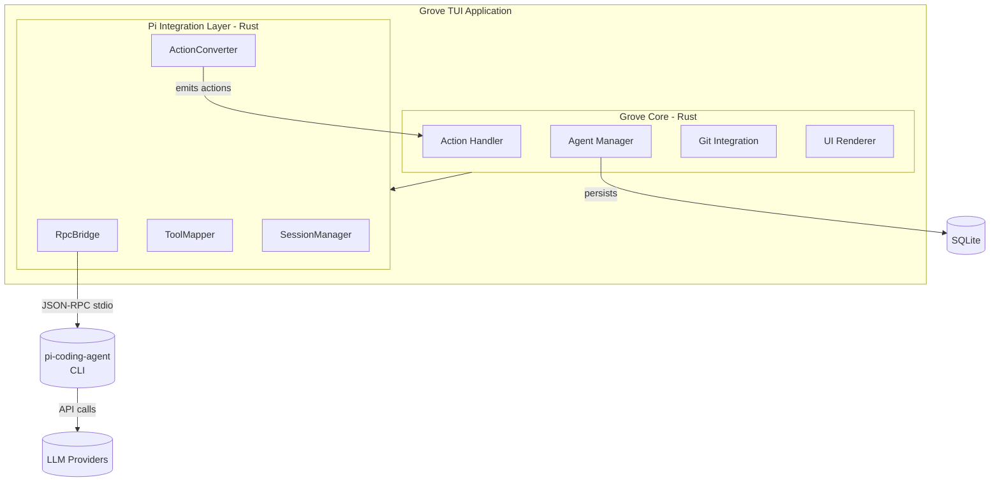
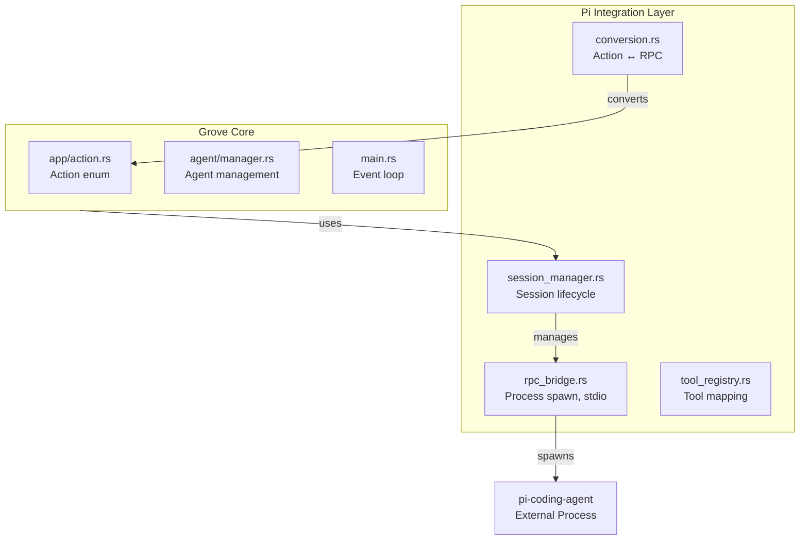
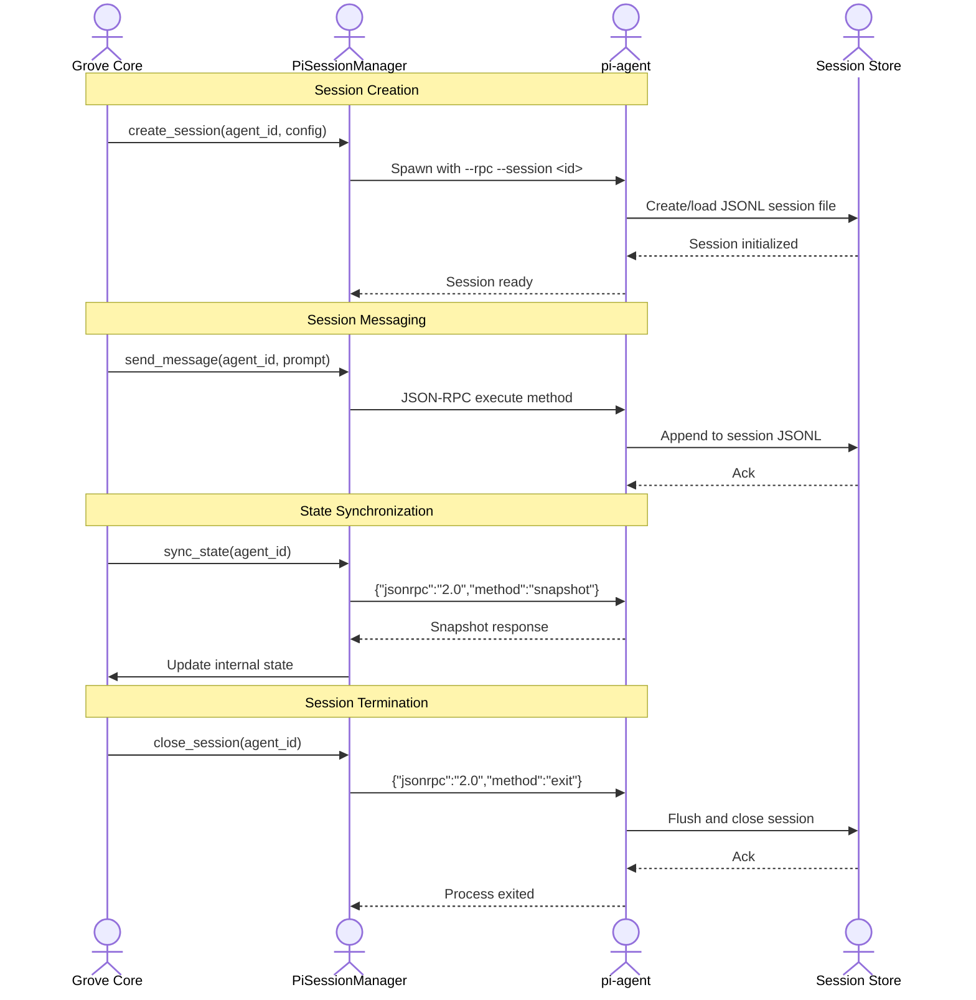

# Pi-Coding Agent Integration - Requirement Document

## 1. Overview

### Project Name
Pi-Coding Agent Integration for Grove

### Project Type
Feature Extension / Plugin Integration

### Core Functionality
Integrate the pi-coding agent (https://github.com/badlogic/pi-mono/) into Grove to enable AI-powered coding assistance with the pi agent while leveraging Grove's existing agent management, git worktree isolation, and TUI capabilities.

### Target Users
- Developers who use Grove for multi-agent management
- Users who want ai-coding assistance via pi agent within Grove's TUI
- Teams using pi for coding with need for Grove's worktree isolation

---

## 2. System Architecture

### Level 1: System Context



### Level 2: Container Diagram



### Use Case Diagram

```mermaid
flowchart LR
    subgraph GroveUseCases["Grove"]
        UC1[Create Agent]
        UC2[Attach to Agent]
        UC3[Execute Tool]
        UC4[View Output]
        UC5[Manage Session]
    end
    
    subgraph PiUseCases["Pi Integration"]
        UC6[Initialize Pi Session]
        UC7[Send Message]
        UC8[Receive Tool Call]
        UC9[Route Tool Result]
        UC10[Sync State]
    end
    
    DEV((Developer)) --> UC1
    DEV --> UC2
    DEV --> UC3
    DEV --> UC4
    DEV --> UC5
    
    UC1 -->|creates| UC6
    UC6 --> PI[pi-agent]
    PI --> UC7
    UC7 --> LLM[LLM]
    LLM --> UC8
    UC8 -->|maps to| UC3
    ```

### Sequence Diagram: Tool Execution Flow

```mermaid
sequenceDiagram
    actor U as Developer
    actor G as Grove Core
    actor P as PiBridge
    actor A as pi-agent
    actor LLM as LLM Provider
    
    Note over U,A: User creates new agent with pi support
    U->>G: Action::CreateAgent { name, branch, enable_pi: true }
    G->>P: spawn_pi_session(agent_id)
    P->>A: Spawn pi process --rpc --session <id>
    
    Note over U,A: User sends message to pi agent
    U->>G: Action::SendToPi { agent_id, message }
    G->>P: send_message(agent_id, message)
    P->>A: {"jsonrpc":"2.0","method":"execute","params":{"prompt":"..."}}
    
    Note over A,LLM: Pi agent processes with LLM
    A->>LLM: API call with prompt + tools
    LLM-->>A: Response with tool_call
    
    Note over A: Pi requests tool execution
    A-->>P: {"jsonrpc":"2.0","method":"tool","params":{"name":"git","args":["status"]}}
    P->>G: emit(Action::RefreshSelected)
    G-->>P: tool_result: "On branch main..."
    
    Note over P: Convert and send back to pi
    P->>A: {"jsonrpc":"2.0","id":1,"result":{"output":"On branch main..."}}
    A->>LLM: Continue with result
    
    Note over A,P: Final response to user
    A-->>P: final_output
    P->>G: emit(Action::UpdateAgentOutput { output })
    G->>U: Display in output panel
```

### Sequence Diagram: Session Lifecycle



---

## 3. Functional Requirements

### FR1: Pi Process Management
| ID | Requirement | Priority | Description |
|----|-------------|----------|-------------|
| FR1.1 | Spawn pi process | MUST | Spawn pi-coding-agent process with --rpc flag for each pi-enabled agent |
| FR1.2 | Process lifecycle | MUST | Handle process start, running, and graceful termination |
| FR1.3 | Process health check | SHOULD | Monitor pi process health and restart if crashed |
| FR1.4 | Environment setup | MUST | Pass required env vars (API keys, session path) to pi process |

### FR2: RPC Communication
| ID | Requirement | Priority | Description |
|----|-------------|----------|-------------|
| FR2.1 | JSON-RPC serialization | MUST | Serialize/deserialize JSON-RPC 2.0 messages |
| FR2.2 | Stdout parsing | MUST | Parse incoming JSON-RPC from pi stdout |
| FR2.3 | Stdin sending | MUST | Send JSON-RPC requests via pi stdin |
| FR2.4 | Stream handling | MUST | Handle streaming output (SSE) from pi |
| FR2.5 | Error handling | MUST | Handle malformed RPC, process errors |

### FR3: Action Conversion
| ID | Requirement | Priority | Description |
|----|-------------|----------|-------------|
| FR3.1 | Action → RPC | MUST | Convert Grove actions to RPC messages |
| FR3.2 | RPC → Action | MUST | Convert RPC messages to Grove actions |
| FR3.3 | Bidirectional sync | MUST | Keep Grove and pi state in sync |

### FR4: Tool Mapping
| ID | Requirement | Priority | Description |
|----|-------------|----------|-------------|
| FR4.1 | git tool mapping | MUST | Map pi's `git` tool to Grove's RefreshSelected |
| FR4.2 | editor tool mapping | MUST | Map pi's `editor` tool to Grove's OpenInEditor |
| FR4.3 | terminal tool mapping | MUST | Map pi's `terminal` tool to Grove's AttachToDevServer |
| FR4.4 | file_ops mapping | MUST | Map pi's `file_ops` tool to Grove's CopyWorktreePath |
| FR4.5 | Custom tool registry | SHOULD | Allow registering custom tools |

### FR5: Session Management
| ID | Requirement | Priority | Description |
|----|-------------|----------|-------------|
| FR5.1 | Session creation | MUST | Create pi session for each Grove agent |
| FR5.2 | Session persistence | MUST | Use pi's JSONL session files |
| FR5.3 | Session restoration | SHOULD | Restore session on Grove restart |
| FR5.4 | Session cleanup | MUST | Clean up sessions on agent deletion |

### FR6: Output Handling
| ID | Requirement | Priority | Description |
|----|-------------|----------|-------------|
| FR6.1 | Stream to UI | MUST | Stream pi output to Grove's output panel |
| FR6.2 | Progress display | SHOULD | Show tool execution progress |
| FR6.3 | Error display | MUST | Display tool errors in UI |

---

## 4. Non-Functional Requirements

### NFR1: Performance
| ID | Requirement | Target |
|----|-------------|--------|
| NFR1.1 | Startup time | < 500ms additional for pi init |
| NFR1.2 | Message latency | < 100ms RPC round-trip |
| NFR1.3 | Memory usage | < 100MB additional per pi session |

### NFR2: Reliability
| ID | Requirement | Description |
|----|-------------|
| NFR2.1 | Graceful degradation | Grove works without pi if process fails |
| NFR2.2 | Process isolation | Pi crash doesn't crash Grove |
| NFR2.3 | Recovery | Auto-reconnect on pi process restart |

### NFR3: Security
| ID | Requirement | Description |
|----|-------------|
| NFR3.1 | API key handling | Don't log sensitive env vars |
| NFR3.2 | Process sandboxing | Run pi with minimal privileges |
| NFR3.3 | Input validation | Sanitize all RPC input |

---

## 5. UI/UX Requirements

### UR1: Integration Points
| ID | Requirement | Description |
|----|-------------|
| UR1.1 | Pi indicator | Show pi status in status bar |
| UR1.2 | Output panel | Display pi output alongside agent output |
| UR1.3 | Configuration | Pi settings in setup modal |

### UR2: Visual Design
| ID | Requirement | Description |
|----|-------------|
| UR2.1 | Pi badge | Show "pi" badge for pi-enabled agents |
| UR2.2 | Status colors | Green=connected, Yellow=busy, Red=error |
| UR2.3 | Help keybind | Show Pi-specific keybinds in help overlay |

---

## 6. Technical Design

### Module Structure

```
src/pi/
├── mod.rs              # Module exports ✓
├── conversion.rs      # Action ↔ RPC conversion ✓
├── rpc_bridge.rs     # Process spawn, stdio handling ✓
├── session.rs        # Session management ✓
├── tool_registry.rs  # Tool registration ✓
└── types.rs         # RPC type definitions ✓
```

### Key Types

```rust
// types.rs
pub struct PiConfig {
    pub provider: String,        // "anthropic", "openai", etc.
    pub model: Option<String>,
    pub api_key: Option<String>,
    pub session_file: Option<String>,
}

pub struct PiMessage {
    pub jsonrpc: String,
    pub id: Option<Value>,
    pub method: Option<String>,
    pub params: Option<Value>,
    pub result: Option<Value>,
    pub error: Option<JsonRpcError>,
}

// session.rs
pub struct PiSession {
    pub agent_id: Uuid,
    pub process: Child,
    pub stdin: Arc<Mutex<ChildStdin>>,
    pub stdout: Arc<BufReader<ChildStdout>>,
    pub session_path: PathBuf,
}

// rpc_bridge.rs
pub struct PiRpcBridge {
    sessions: HashMap<Uuid, PiSession>,
    config: PiConfig,
}
```

### Test Structure

```
tests/
├── pi/
│   ├── mod.rs
│   ├── rpc_serialization_test.rs    # JSON-RPC parsing
│   ├── action_conversion_test.rs # Action ↔ RPC mapping
│   ├── tool_mapping_test.rs    # Tool call mapping
│   ├── session_test.rs        # Session lifecycle
│   └── integration_test.rs    # Full flow tests
```

---

## 7. Tasks

### Phase 1: Core Infrastructure

| Task ID | Task | Dependencies | Type |
|--------|------|-------------|------|
| T1.1 | Fix pi/conversion.rs imports | None | Bug fix |
| T1.2 | Create src/pi/types.rs | None | New file |
| T1.3 | Create src/pi/rpc_bridge.rs | T1.2 | New file |
| T1.4 | Create src/pi/session.rs | T1.3 | New file |
| T1.5 | Create src/pi/tool_registry.rs | T1.2 | New file |

### Phase 2: Integration

| Task ID | Task | Dependencies | Type |
|--------|------|-------------|------|
| T2.1 | Add pi config to AppConfig | None | Extension |
| T2.2 | Add PiStartSession to Action | None | Extension |
| T2.3 | Integrate PiSessionManager in main.rs | T1.4, T2.1 | Integration |
| T2.4 | Add Action → PiRPC forward | T1.3, T2.2 | Extension |

### Phase 3: Testing

| Task ID | Task | Dependencies | Type |
|--------|------|-------------|------|
| T3.1 | Add RPC serialization test | T1.2 | Test |
| T3.2 | Add action conversion test | T1.3 | Test |
| T3.3 | Add tool mapping test | T1.5 | Test |
| T3.4 | Add session integration test | T1.4 | Test |

### Phase 4: UI Polish

| Task ID | Task | Dependencies | Type |
|--------|------|-------------|------|
| T4.1 | Add pi indicator to status bar | T2.3 | UI |
| T4.2 | Add pi settings to setup modal | T2.1 | UI |
| T4.3 | Update help overlay | T4.1 | UI |

---

## 8. Tests

### Unit Tests

#### T1.2: RPC Serialization Tests

```rust
#[cfg(test)]
mod rpc_serialization {
    use super::*;
    
    #[test]
    fn test_serialize_execute_request() {
        let msg = PiMessage::new_execute("test prompt");
        let json = serde_json::to_string(&msg).unwrap();
        assert!(json.contains("\"method\":\"execute\""));
        assert!(json.contains("test prompt"));
    }
    
    #[test]
    fn test_deserialize_tool_response() {
        let json = r#"{"jsonrpc":"2.0","id":1,"result":{"output":"ok"}}"#;
        let msg: PiMessage = serde_json::from_str(json).unwrap();
        assert!(msg.result.is_some());
    }
    
    #[test]
    fn test_deserialize_error() {
        let json = r#"{"jsonrpc":"2.0","error":{"code":-32600,"message":"Invalid Request"}}"#;
        let msg: PiMessage = serde_json::from_str(json).unwrap();
        assert!(msg.error.is_some());
    }
}
```

#### T1.3: Action Conversion Tests

```rust
#[cfg(test)]
mod action_conversion {
    use super::*;
    
    #[test]
    fn test_create_agent_to_rpc() {
        let action = Action::CreateAgent {
            name: "test".into(),
            branch: "feature/test".into(),
            task: None,
        };
        let rpc = action_to_rpc(&action);
        assert!(matches!(rpc, Some(PiMessage { method: Some(m), .. }) if m == "create"));
    }
    
    #[test]
    fn test_rpc_tool_to_action() {
        let rpc = PiMessage::new_tool("git", vec!["status".into()]);
        let action = rpc_to_action(rpc);
        assert!(matches!(action, Action::RefreshSelected));
    }
    
    #[test]
    fn test_editor_tool_to_action() {
        let rpc = PiMessage::new_tool("editor", vec!["abc123".into()]);
        let action = rpc_to_action(rpc);
        assert!(matches!(action, Action::OpenInEditor { id } if id.to_string() == "00000000-0000-0000-0000-000000000abc"));
    }
}
```

#### T1.5: Tool Mapping Tests

```rust
#[cfg(test)]
mod tool_mapping {
    use super::*;
    
    #[test]
    fn test_git_tool_mapping() {
        assert_eq!(map_tool("git", &["status"]), ToolMapping::Action(Action::RefreshSelected));
        assert_eq!(map_tool("git", &["diff"]), ToolMapping::Action(Action::ToggleDiffView));
    }
    
    #[test]
    fn test_editor_tool_mapping() {
        let uuid = Uuid::new_v4();
        let args = vec![uuid.to_string()];
        assert!(matches!(map_tool("editor", &args), ToolMapping::Action(Action::OpenInEditor { .. })));
    }
    
    #[test]
    fn test_terminal_tool_mapping() {
        let uuid = Uuid::new_v4();
        let args = vec![uuid.to_string()];
        assert!(matches!(map_tool("terminal", &args), ToolMapping::Action(Action::AttachToDevServer { .. })));
    }
    
    #[test]
    fn test_unknown_tool_returns_none() {
        assert_eq!(map_tool("unknown_tool", &[]), ToolMapping::Unknown);
    }
}
```

### Integration Tests

#### T3.4: Session Integration Test

```rust
#[cfg(test)]
mod session_integration {
    use super::*;
    
    #[tokio::test]
    async fn test_session_create_and_message() {
        // Setup mock pi process
        let config = PiConfig {
            provider: "anthropic".into(),
            ..Default::default()
        };
        
        let bridge = PiRpcBridge::new(config);
        let agent_id = Uuid::new_v4();
        
        // Create session
        let result = bridge.create_session(agent_id, "test".into(), "main".into()).await;
        assert!(result.is_ok());
        
        // Send message
        let msg_result = bridge.send_message(agent_id, "Hello".into()).await;
        assert!(msg_result.is_ok());
        
        // Cleanup
        bridge.close_session(agent_id).await;
    }
}
```

### Test Coverage Goals

| Module | Target Coverage |
|--------|--------------|
| types.rs | 100% |
| rpc_bridge.rs | 80%+ |
| session.rs | 80%+ |
| conversion.rs | 90%+ |
| tool_registry.rs | 90%+ |

---

## 9. Acceptance Criteria

### AC1: Pi Process Management
- [ ] Grove can spawn pi process with `--rpc` flag
- [ ] Process is cleaned up when agent is deleted
- [ ] Process errors are logged and handled gracefully

### AC2: RPC Communication
- [ ] JSON-RPC messages are correctly serialized/deserialized
- [ ] Stdout is parsed without blocking
- [ ] Stdin sends messages without blocking

### AC3: Action Conversion
- [ ] All defined actions convert correctly to RPC
- [ ] All RPC tool calls convert to Grove actions
- [ ] Bi-directional sync works

### AC4: Tool Mapping
- [ ] git status → RefreshSelected works
- [ ] git diff → ToggleDiffView works
- [ ] editor <uuid> → OpenInEditor works
- [ ] terminal <uuid> → AttachToDevServer works

### AC5: Session Management
- [ ] Each Grove agent has a pi session
- [ ] Session persists to JSONL file
- [ ] Session can be restored on restart

### AC6: Output Handling
- [ ] Pi output displays in Grove output panel
- [ ] Tool execution shows progress
- [ ] Errors are displayed in UI

---

## 10. Dependencies & External Interfaces

### External Dependencies
- `@mariozechner/pi-coding-agent` - Installed via npm, invoked as subprocess
- `pi` command available in PATH

### Configuration
```toml
# grove.config.toml
[pi]
enabled = true
provider = "anthropic"
model = "claude-3-5-sonnet-20241022"
# API key via ANTHROPIC_API_KEY env var
```

### Environment Variables
- `ANTHROPIC_API_KEY` - Anthropic API key
- `OPENAI_API_KEY` - OpenAI API key  
- `GOOGLE_API_KEY` - Google API key
- `PI_SESSION_DIR` - Session directory (default: ~/.pi/agent/sessions/)

---

## 11. Error Handling

### Error Codes
| Code | Description | Handling |
|------|-------------|----------|
| E001 | Pi process not found | Show error, suggest npm install |
| E002 | Process spawn failed | Log, show error, retry |
| E003 | Invalid RPC response | Log, discard, continue |
| E004 | Tool execution failed | Return error to pi |
| E005 | Session restore failed | Create new session |

### Logging
- Use `tracing` crate with `info` level for normal operations
- `debug` for RPC traffic
- `error` for failures

---

## 12. OpenAPI Specification

### Pi Integration API Endpoints

| Method | Endpoint | Description | Request Body | Response |
|--------|----------|--------------|---------------|-----------|
| POST | `/pi/sessions` | Create new pi session | `CreateSessionRequest` | `SessionResponse` |
| GET | `/pi/sessions/{id}` | Get session state | - | `SessionState` |
| POST | `/pi/sessions/{id}/messages` | Send message to pi | `MessageRequest` | `MessageResponse` |
| DELETE | `/pi/sessions/{id}` | Close session | - | `SuccessResponse` |
| GET | `/pi/tools` | List available tools | - | `ToolList` |

### API Schemas

```yaml
components:
  schemas:
    CreateSessionRequest:
      type: object
      required:
        - agent_id
        - branch
      properties:
        agent_id:
          type: string
          format: uuid
        branch:
          type: string
        name:
          type: string
        provider:
          type: string
          enum: [anthropic, openai, google]
        model:
          type: string

    SessionResponse:
      type: object
      properties:
        session_id:
          type: string
          format: uuid
        status:
          type: string
          enum: [created, running, error, closed]
        worktree_path:
          type: string

    MessageRequest:
      type: object
      required:
        - content
      properties:
        content:
          type: string
        stream:
          type: boolean
          default: true

    MessageResponse:
      type: object
      properties:
        output:
          type: string
        tool_calls:
          type: array
          items:
            $ref: '#/components/schemas/ToolCall'

    ToolCall:
      type: object
      properties:
        tool:
          type: string
        args:
          type: array
          items:
            type: string
        result:
          type: string

    SessionState:
      type: object
      properties:
        agent_id:
          type: string
        branch:
          type: string
        status:
          type: string
        output_buffer:
          type: array
          items:
            type: string
        last_message:
          type: string

    ToolList:
      type: object
      properties:
        tools:
          type: array
          items:
            $ref: '#/components/schemas/ToolDefinition'

    ToolDefinition:
      type: object
      properties:
        name:
          type: string
        description:
          type: string
        parameters:
          type: array
          items:
            type: string

    SuccessResponse:
      type: object
      properties:
        success:
          type: boolean
        message:
          type: string
```

### RPC Protocol (pi ↔ Grove)

```yaml
jsonrpc: "2.0"

methods:
  execute:
    description: Execute pi agent with prompt
    params:
      type: object
      properties:
        prompt:
          type: string
        session_file:
          type: string

  tool:
    description: Request tool execution
    params:
      type: object
      properties:
        name:
          type: string
        args:
          type: array
          items:
            type: string
    result:
      output: string

  snapshot:
    description: Request agent state snapshot
    result:
      type: object
      properties:
        name: string
        branch: string
        status: string
        output: array

  exit:
    description: Gracefully close session
```

### Error Responses

| HTTP Code | Code | Message |
|-----------|------|----------|
| 400 | E001 | Bad Request - Invalid parameters |
| 404 | E002 | Session not found |
| 500 | E003 | Pi process error |
| 503 | E004 | LLM provider unavailable |

---

## 13. Out of Scope

- MCP server integration (future work)
- Custom pi extensions (future work)
- Multi-provider fallback (future work)
- WebUI integration (not applicable)