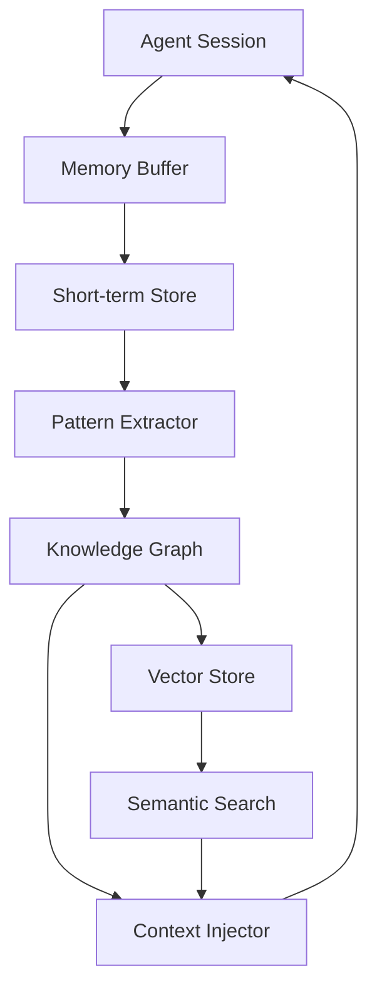

# Grove 10x Roadmap: Transformative Improvements

This document outlines ambitious improvements that would deliver 10x value leaps for Grove, transforming it from a powerful agent manager into an indispensable AI-augmented development platform.

---

## Current State Summary

**Grove v0.2.0** provides:
- Multi-agent management with git worktree isolation
- Support for 4 AI coding agents (Claude Code, Opencode, Codex, Gemini)
- Project management integrations (Asana, Notion, ClickUp, Airtable, Linear)
- Git provider integrations (GitHub, GitLab, Codeberg)
- Real-time monitoring and dev server management
- Session persistence with tmux

---

## 10x Improvement Categories

### 1. **Cognitive Multiplication: Agent Orchestration Engine** (10x Efficiency)

Transform Grove from a passive monitor into an active orchestrator that enables agents to collaborate, delegate, and compound their productivity.

#### What It Enables
- **Agent-to-Agent Communication**: Agents can request help from other agents
- **Task Decomposition**: Super-agent breaks down epics into subtasks for worker agents
- **Parallel Specialization**: Different agents work on frontend, backend, tests simultaneously
- **Result Synthesis**: Automatic merging of work from multiple agents

#### Key Features
| Feature | Description | Impact |
|---------|-------------|--------|
| **Orchestrator Mode** | One agent coordinates others | 5x productivity on complex tasks |
| **Agent Skills Registry** | Tag agents with capabilities (rust, frontend, testing) | Optimal task routing |
| **Dependency Visualization** | See task dependencies across agents | Prevent integration conflicts |
| **Consensus Protocol** | Multiple agents review each other's code | Quality multiplier |

#### Implementation
```
src/orchestration/
├── mod.rs              # Orchestration engine
├── coordinator.rs      # Super-agent coordinator
├── skills.rs           # Capability registry
├── routing.rs          # Task-to-agent routing
├── consensus.rs        # Multi-agent review
└── synthesis.rs        # Result merging
```

#### Success Metrics
- Complex feature delivery time: **-70%**
- Code review quality: **+300%** (3-agent review)
- Agent utilization: **90%+** (vs ~40% passive waiting)

---

### 2. **Temporal Intelligence: Predictive Progress Analytics** (10x Visibility)

Transform status monitoring into predictive intelligence that foresees problems and optimizes workflows.

#### What It Enables
- **Time-to-Completion Prediction**: ML-based estimation of when tasks will finish
- **Blocker Prediction**: Detect patterns that historically lead to stuck agents
- **Resource Optimization**: Auto-scale agent count based on work queue
- **Anomaly Detection**: Alert when agent behavior deviates from norms

#### Key Features
| Feature | Description | Impact |
|---------|-------------|--------|
| **Velocity Tracking** | Tokens/hour, commits/day per agent | Productivity baseline |
| **Predictive ETA** | "This task will complete in ~2h 15m" | Planning confidence |
| **Drift Detection** | "Agent A is 40% slower than usual" | Early warning system |
| **Success Probability** | "85% chance this PR passes CI" | Decision support |

#### Implementation
```
src/analytics/
├── mod.rs              # Analytics engine
├── metrics.rs          # Metric collection
├── prediction.rs       # ML-based predictions
├── anomalies.rs        # Anomaly detection
└── reports.rs          # Generate insights
```

#### Data Collected
- Token consumption rate per agent/model
- Message frequency and complexity
- Git operation patterns
- CI/CD pass/fail ratios
- Time-in-status distributions

#### Success Metrics
- Planning accuracy: **±15%** on completion estimates
- Issue detection: **48h earlier** on average
- Resource efficiency: **+40%** utilization

---

### 3. **Memory Amplification: Persistent Knowledge Graph** (10x Context)

Transform isolated agent sessions into a connected knowledge system that remembers and learns.

#### What It Enables
- **Cross-Session Memory**: Agents recall previous work on the same codebase
- **Decision Archaeology**: Understand why past changes were made
- **Pattern Library**: Reuse successful approaches across projects
- **Context Compression**: Smart summarization for long-running projects

#### Key Features
| Feature | Description | Impact |
|---------|-------------|--------|
| **Project Memory** | Persistent context across agent sessions | 80% less re-explanation |
| **Decision Journal** | Auto-logged decisions with rationale | Audit trail |
| **Pattern Extraction** | Learn from successful completions | Accelerate new work |
| **Knowledge Search** | "How did we solve auth before?" | Instant answers |

#### Memory Architecture


#### Implementation
```
src/memory/
├── mod.rs              # Memory system
├── buffer.rs           # Session memory buffer
├── graph.rs            # Knowledge graph (via Beads integration)
├── vector_store.rs     # Embedding storage
├── compression.rs      # Context summarization
└── retrieval.rs        # Smart context injection
```

#### Storage Strategy
- **Hot**: Last 24h in memory
- **Warm**: Last 7 days in SQLite
- **Cold**: Compressed summaries in vector store

#### Success Metrics
- Context reuse: **80%** of sessions reference past work
- Onboarding time: **-60%** for new agents on existing projects
- Decision recovery: **<30s** to find rationale

---

### 4. **Interface Evolution: Multi-Modal Dashboard** (10x Usability)

Transform the terminal UI into a flexible multi-modal interface accessible anywhere.

#### What It Enables
- **Web Dashboard**: Browser-based monitoring and control
- **Mobile Companion**: iOS/Android app for on-the-go monitoring
- **IDE Integration**: VS Code / JetBrains plugin for in-editor control
- **Voice Commands**: "Hey Grove, show me the stuck agent"

#### Key Features
| Feature | Description | Impact |
|---------|-------------|--------|
| **Web UI** | React dashboard synced with TUI state | Remote monitoring |
| **Mobile Push** | Alerts when agents need attention | Always connected |
| **IDE Panel** | Agent status in development workflow | Context switching |
| **Natural Language** | "Create agent for auth feature" | Frictionless interaction |

#### Architecture Evolution
```
┌─────────────────────────────────────────────────────┐
│                  Grove Core (Rust)                  │
│                     Event Bus                       │
├─────────────────────────────────────────────────────┤
│    TUI     │    Web UI    │   Mobile   │   IDE      │
│  (ratatui) │   (React)    │  (Flutter) │ (Extension)│
└─────────────────────────────────────────────────────┘
```

#### Implementation Path
1. **Event Bus**: RefactorAppState to emit events
2. **WebSocket Server**: Real-time sync to web/mobile
3. **API Layer**: RESTful control endpoints
4. **Frontends**: Web, Mobile, IDE integration

#### Success Metrics
- Remote access: **100%** of core features available
- Response time: **<200ms** for all operations
- Offline support: Queue commands when disconnected

---

### 5. **Automated Quality: Self-Healing Pipelines** (10x Reliability)

Transform reactive error handling into proactive quality assurance.

#### What It Enables
- **Auto-Fix**: Agents automatically fix their own failing tests
- **Pre-Commit Intelligence**: Predict CI failures before push
- **Drift Correction**: Detect and fix code quality degradation
- **Conflict Prevention**: Know about merge conflicts before they happen

#### Key Features
| Feature | Description | Impact |
|---------|-------------|--------|
| **Test Watchdog** | Auto-trigger agent on test failure | Self-healing |
| **CI Predictor** | "90% chance this fails CI" | Prevent wasting time |
| **Quality Gate** | Block merge on quality thresholds | Standards enforcement |
| **Conflict Radar** | "Main branch moved, merge now" | Prevent integration hell |

#### Implementation
```
src/quality/
├── mod.rs              # Quality engine
├── watchdog.rs         # Auto-fix triggers
├── predictor.rs        # CI outcome prediction
├── gates.rs            # Quality thresholds
└── conflicts.rs        # Early conflict detection
```

#### Workflow Integration
```
Agent Commits → Quality Gate → CI Predictor → Auto-Fix (if needed)
                    ↓
              Block if critical
```

#### Success Metrics
- CI failure rate: **-80%** after implementation
- Self-fix success: **70%** of test failures auto-resolved
- Merge conflicts: **-90%** with early warning

---

### 6. **Collaborative Scale: Team Workspaces** (10x Adoption)

Transform single-user Grove into a team collaboration platform.

#### What It Enables
- **Shared Projects**: Team members see all active agents
- **Role Permissions**: Owner, Developer, Viewer roles
- **Agent Handoff**: Transfer agents between team members
- **Audit Trail**: Who did what, when, and why

#### Key Features
| Feature | Description | Impact |
|---------|-------------|--------|
| **Workspace Sync** | Shared project configuration | Team onboarding instantly |
| **Agent Pool** | See all team's agents in one view | Resource awareness |
| **Assignment** | "Agent X is owned by @teammate" | Accountability |
| **Activity Feed** | Real-time team activity log | Awareness |

#### Data Model
```sql
-- Team workspace schema
CREATE TABLE workspaces (
    id UUID PRIMARY KEY,
    name TEXT,
    settings JSONB
);

CREATE TABLE workspace_members (
    workspace_id UUID REFERENCES workspaces(id),
    user_id UUID,
    role TEXT CHECK (role IN ('owner', 'developer', 'viewer'))
);

CREATE TABLE agents (
    id UUID PRIMARY KEY,
    workspace_id UUID REFERENCES workspaces(id),
    owner_id UUID,
    status TEXT
);
```

#### Success Metrics
- Team onboarding: **<5 minutes** to join workspace
- Collaboration: **40%** of agents worked on by multiple people
- Accountability: **100%** traceability

---

### 7. **Cost Intelligence: Token Economics Dashboard** (10x ROI Visibility)

Transform token usage from a mystery into an optimized investment.

#### What It Enables
- **Real-Time Spend**: Know exactly what each agent costs
- **Budget Alerts**: "You've spent $50 today, $20 over target"
- **ROI Tracking**: Cost per completed task, PR merged
- **Optimization Tips**: "Switching to Opencode would save $200/week"

#### Key Features
| Feature | Description | Impact |
|---------|-------------|--------|
| **Spend Tracker** | Real-time token + cost monitoring | Budget awareness |
| **Agent Comparison** | Cost/quality ratio per provider | Optimal selection |
| **Budget Pacing** | "At current rate, you'll spend $X this month" | Early warning |
| **Efficiency Score** | Quality output per dollar spent | ROI visibility |

#### Cost Model
```rust
pub struct CostBreakdown {
    pub input_tokens: u64,
    pub output_tokens: u64,
    pub cache_read_tokens: u64,
    pub cache_write_tokens: u64,
    pub provider: Provider,
    
    // Pricing (configurable)
    pub input_cost_per_1k: Decimal,
    pub output_cost_per_1k: Decimal,
}

impl CostBreakdown {
    pub fn calculate(&self) -> Decimal {
        // Provider-specific pricing logic
    }
}
```

#### Success Metrics
- Cost visibility: **100%** of spend tracked
- Optimization: **-30%** cost after 2 weeks of awareness
- ROI clarity: **$"cost per merged PR"** visible

---

### 8. **Security Fortress: Secret Management System** (10x Trust)

Transform scattered API tokens into a secure, auditable secret management system.

#### What It Enables
- **Encrypted Storage**: Tokens never stored in plaintext
- **Scoped Permissions**: Fine-grained token permissions
- **Rotation Reminders**: "Your GitLab token is 90 days old"
- **Usage Audit**: Know exactly when tokens were used

#### Key Features
| Feature | Description | Impact |
|---------|-------------|--------|
| **Secrets Vault** | Encrypted token storage | Peace of mind |
| **Token Scopes** | Minimal permissions per token | Least privilege |
| **Rotation Nudge** | Prompts for token rotation | Security hygiene |
| **Access Log** | Every token use logged | Audit trail |

#### Implementation
```
src/security/
├── mod.rs              # Security module
├── vault.rs            # Encrypted storage (age/rage)
├── scopes.rs           # Permission definitions
├── rotation.rs         # Token lifecycle
└── audit.rs            # Access logging
```

#### Security Architecture
```
Untrusted Environment
        │
        ▼
┌─────────────────┐
│  Grove Process  │
│  ┌───────────┐  │
│  │ Keychain  │  │  ← OS keychain integration
│  └───────────┘  │
│         │       │
│         ▼       │
│  ┌───────────┐  │
│  │ Decrypted │  │  ← In-memory only
│  │  Tokens   │  │
│  └───────────┘  │
└─────────────────┘
```

#### Success Metrics
- Token exposure: **0** tokens in plaintext
- Rotation compliance: **95%** before expiration
- Audit coverage: **100%** of token accesses logged

---

### 9. **Ecosystem Extension: Plugin Marketplace** (10x Flexibility)

Transform Grove into an extensible platform with a plugin ecosystem.

#### What It Enables
- **Custom Integrations**: Anyone can add new PM tools, git providers
- **UI Extensions**: Custom panels, widgets, visualizations
- **Agent Extensions**: New AI providers, prompt templates
- **Workflow Automation**: Custom triggers, actions, reactions

#### Key Features
| Feature | Description | Impact |
|---------|-------------|--------|
| **Plugin API** | Stable Rust plugin interface | Extensibility |
| **Package Manager** | Install plugins from registry | Easy adoption |
| **Sandboxing** | Isolated plugin execution | Safety |
| **Marketplace UI** | Browse and install from TUI | Discovery |

#### Plugin Architecture
```rust
// Plugin trait definition
pub trait GrovePlugin: Send + Sync {
    fn id(&self) -> &str;
    fn name(&self) -> &str;
    fn version(&self) -> &str;
    
    // Lifecycle hooks
    fn on_load(&mut self, ctx: &PluginContext) -> Result<()>;
    fn on_unload(&mut self) -> Result<()>;
    
    // Extension points
    fn actions(&self) -> Vec<ActionHandler>;
    fn ui_panels(&self) -> Vec<Box<dyn UiPanel>>;
    fn integrations(&self) -> Vec<Box<dyn Integration>>;
}
```

#### Plugin Types
| Type | Example | Purpose |
|------|---------|---------|
| Integration | Jira plugin | New PM tool |
| UI Extension | Kanban board | Custom visualization |
| Agent | Mistral AI | New AI provider |
| Automation | Auto-reviewer | Custom workflow |

#### Success Metrics
- Plugin count: **50+** available plugins
- Adoption: **60%** of users have at least one plugin
- Quality: **4.5+** star average rating

---

### 10. **Developer Experience: Zero-Friction Onboarding** (10x Adoption)

Transform the learning curve into a delightful onboarding experience.

#### What It Enables
- **Guided Setup**: Interactive wizard for first-time users
- **Just-in-Time Help**: Contextual help that appears when needed
- **Best Practice Defaults**: Grove works great out of the box
- **Template Library**: Pre-configured setups for common stacks

#### Key Features
| Feature | Description | Impact |
|---------|-------------|--------|
| **Setup Wizard** | 5-step guided first launch | Quick start |
| **Interactive Tutorial** | Learn-by-doing tutorial missions | Skill building |
| **Smart Defaults** | AI agent auto-detected | Zero config |
| **Project Templates** | "React + TypeScript + Jest" preset | Instant setup |

#### Onboarding Journey
```
┌─────────────────────────────────────────────────────┐
│ Day 0: Installation                                 │
│   • 60-second install                               │
│   • 5-minute setup wizard                           │
│   • Create first agent                              │
└─────────────────────────────────────────────────────┘
         ↓
┌─────────────────────────────────────────────────────┐
│ Day 1-7: Learning                                   │
│   • Daily tutorial missions                         │
│   • Contextual tips                                 │
│   • Best practice suggestions                       │
└─────────────────────────────────────────────────────┘
         ↓
┌─────────────────────────────────────────────────────┐
│ Week 2+: Mastery                                    │
│   • Advanced features suggested                     │
│   • Productivity insights                           │
│   • Community highlights                            │
└─────────────────────────────────────────────────────┘
```

#### Tutorial Missions
| Mission | Teaches | Duration |
|---------|---------|----------|
| First Agent | Create, attach, observe | 10 min |
| Task Linking | PM integration | 10 min |
| Dev Server | Server management | 10 min |
| Git Workflow | Merge, push, PR | 15 min |
| Multi-Agent | Parallel development | 15 min |

#### Success Metrics
- Activation: **90%** create first agent within 10 minutes
- Retention (D7): **70%** of new users return
- NPS: **50+** Net Promoter Score

---

## Implementation Timeline

### Phase 1: Foundation (Q1)
- **Cognitive Multiplication**: Basic agent communication
- **Cost Intelligence**: Token tracking (foundational)
- **Developer Experience**: Setup wizard + first tutorial

### Phase 2: Intelligence (Q2)
- **Temporal Intelligence**: Metrics collection + basic predictions
- **Memory Amplification**: Session persistence (leverages existing Beads work)
- **Security Fortress**: Encrypted secrets vault

### Phase 3: Scale (Q3)
- **Interface Evolution**: Web dashboard foundation
- **Automated Quality**: Test watchdog + CI prediction
- **Team Workspaces**: Multi-user sync

### Phase 4: Ecosystem (Q4)
- **Ecosystem Extension**: Plugin API + marketplace
- **Interface Evolution**: Mobile app + IDE integration
- **Memory Amplification**: Knowledge graph + pattern extraction

---

## Architectural Evolution

### Current Architecture
```
┌─────────────────────────────────────┐
│           Grove TUI                 │
│  ┌─────────────────────────────┐   │
│  │       AppState              │   │
│  └─────────────────────────────┘   │
│              │                      │
│  ┌───────────┼───────────────────┐ │
│  │ Agent     │ Git     │ Storage │ │
│  │ Manager   │ Ops     │         │ │
│  └───────────┴──────────┴─────────┘ │
└─────────────────────────────────────┘
```

### Future Architecture (10x)
```
┌──────────────────────────────────────────────────────────────┐
│                        Grove Core                             │
│  ┌─────────────────────────────────────────────────────────┐│
│  │                     Event Bus                            ││
│  └─────────────────────────────────────────────────────────┘│
│            │              │              │                   │
│  ┌─────────┴────────┐ ┌───┴────┐ ┌──────┴───────┐          │
│  │ Orchestration    │ │Memory  │ │  Analytics   │          │
│  │ Engine           │ │System  │ │  Engine      │          │
│  └──────────────────┘ └────────┘ └──────────────┘          │
│                                                              │
│  ┌──────────────────┐ ┌────────┐ ┌───────────────────────┐ │
│  │ Security Vault   │ │Quality │ │ Plugin Runtime        │ │
│  └──────────────────┘ │ Engine │ └───────────────────────┘ │
│                       └────────┘                             │
└──────────────────────────────────────────────────────────────┘
         │              │              │              │
    ┌────┴────┐    ┌─────┴─────┐  ┌─────┴─────┐  ┌────┴────┐
    │   TUI   │    │  Web API  │  │  Mobile   │  │   IDE   │
    │         │    │           │  │ Bridge    │  │ Plugin  │
    └─────────┘    └───────────┘  └───────────┘  └─────────┘
```

---

## Quick Wins (Immediate Impact)

These improvements can be delivered quickly for outsized user value:

| Improvement | Effort | Impact | Description |
|-------------|--------|--------|-------------|
| **Token Counter** | 2 days | High | Show live token usage in status bar |
| **Agent Templates** | 3 days | High | Save agent configurations as templates |
| **Smart Branch Naming** | 1 day | Medium | Auto-suggest branch names from tasks |
| **Push Confirmation** | 1 day | Medium | "Are you sure?" for destructive actions |
| **Agent Health Score** | 3 days | High | 0-100 score based on recent performance |
| **Quick Actions** | 2 days | High | `n` → `Enter` → typed name (fast path) |

---

## Success Metrics Summary

| Category | Current | 10x Target | Metric |
|----------|---------|------------|--------|
| Efficiency | 1 agent/task | 5 agents/workflow | Parallelization |
| Visibility | Status only | Predictive | Time saved |
| Memory | Session-only | Cross-session | Context reuse |
| Usability | Terminal-only | Multi-modal | Access points |
| Reliability | Reactive fix | Self-healing | Auto-recovery |
| Scale | Single-user | Teams | Collaboration |
| Cost | Unknown | Tracked | Savings |
| Security | Plaintext tokens | Encrypted | Trust |
| Flexibility | Hardcoded | Pluggable | Extensions |
| Adoption | Hours to value | Seconds | Onboarding |

---

## Conclusion

These 10x improvements transform Grove from a powerful tool into an **AI-augmented development platform** that:

1. **Orchestrates** multiple agents for compound productivity
2. **Predicts** outcomes for confident planning
3. **Remembers** context for seamless continuity
4. **Evangelizes** through multiple interfaces
5. **Heals** itself through automated quality
6. **Scales** to team collaboration
7. **Tracks** costs for ROI visibility
8. **Secures** secrets for trust
9. **Extends** through plugins
10. **Onboards** instantly for adoption

The goal is not incremental improvement but **order-of-magnitude value creation** for developers who work with AI coding agents.

---

*Last Updated: April 2025*
*Version: 1.0*